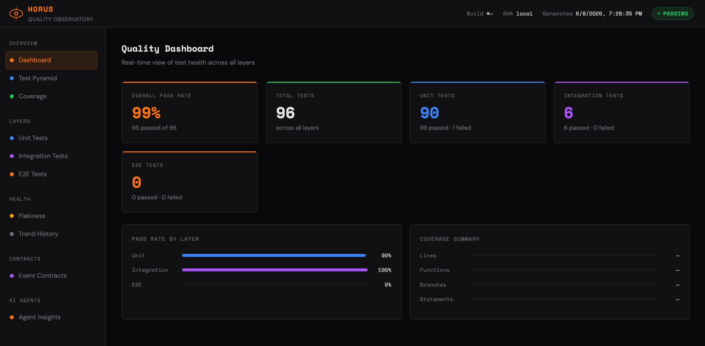
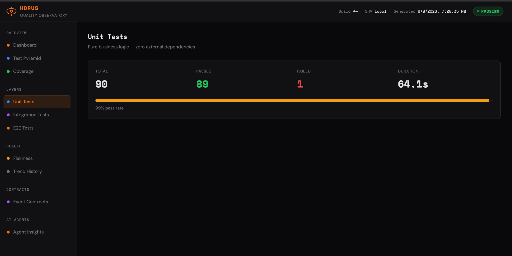
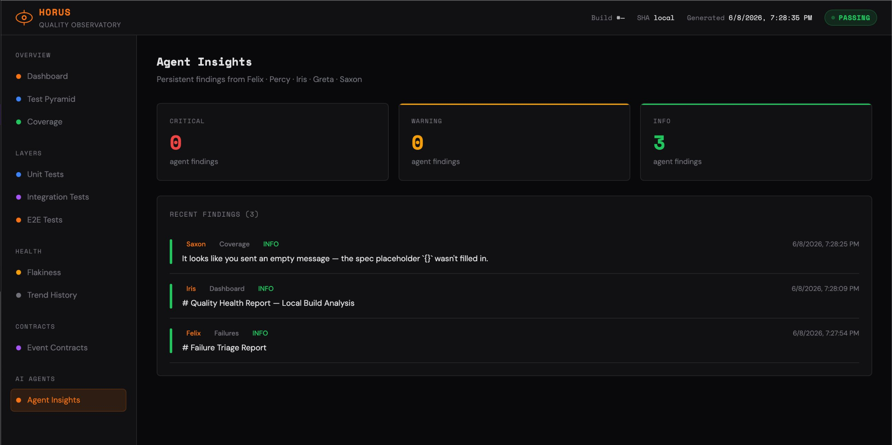
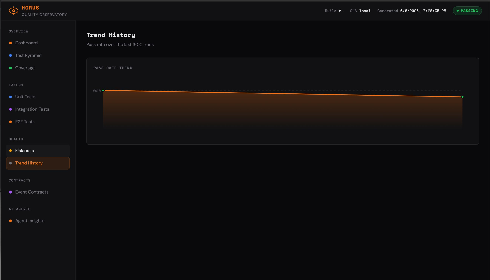

# 🔭 Horus — Quality Observatory

> *"The all-seeing eye over your test suite."*

Horus is a quality observability platform for TypeScript/Node.js microservice systems. It tracks quality signals over time — flakiness rates, coverage drift, event contract gaps, and AI agent findings — and surfaces them in a persistent dashboard.

The `order-service` and `notification-service` in `example/` are **reference subjects**: realistic microservices used to demonstrate Horus's observability capabilities. They are not the product. Horus is.

[](https://github.com/DHenry7471/horus/actions/workflows/ci.yml)
[](https://dhenry7471.github.io/horus/dashboard/)

---

## Screenshots

<table>
  <tr>
    <td><strong>Quality Dashboard</strong></td>
    <td><strong>Unit Tests</strong></td>
  </tr>
  <tr>
    <td></td>
    <td></td>
  </tr>
  <tr>
    <td><strong>Agent Insights</strong></td>
    <td><strong>Trend History</strong></td>
  </tr>
  <tr>
    <td></td>
    <td></td>
  </tr>
</table>

---

## What Horus Provides

**`@wutangbanger/horus-insight-store`** — the observability persistence layer. Stores agent findings, per-test run history, and coverage snapshots as JSONL. Everything the dashboard reads comes from here. Includes the `horus-ingest` CLI for ingesting any test runner's JSON output.

**`@wutangbanger/horus-contracts`** — shared interfaces (`IAgentInsightStore`, `ITestRunStore`, `IEventBus`, `IRepository`, `HorusConfig`) that keep the platform's boundaries clean and swappable.

**`@wutangbanger/horus-test-utils`** — injectable mock implementations of those interfaces, so the reference subjects can be exercised at the integration layer without real infrastructure. Private — not published to npm.

**`@wutangbanger/horus-dashboard`** — the dashboard generator. Reads test results, coverage snapshots, flakiness data, and agent insights from a `reportsDir` and writes a self-contained HTML observatory plus supporting JSON files. Usable as a CLI (`horus-dashboard`) or programmatically via `generate()`. Published to npm.

**AI Agent pipeline** — twelve Claude agents (Felix, Percy, Iris, Greta, Saxon, Clint, Ambrosine, Ernie, Furio, Kurt, Pat, Tessa) whose findings are persisted as structured `AgentInsight` records rather than ephemeral stdout.

**Event contract analyzer** — static analysis that detects which event topics lack publish or subscribe test coverage, runnable as a CI gate.

---

## Installing from npm

### Primary path: post-run ingestion (any test runner)

Works with Vitest, Jest, Mocha, Pytest — any runner that emits JSON output.

```bash
pnpm add @wutangbanger/horus-contracts @wutangbanger/horus-insight-store

# Optional: generate the HTML dashboard
pnpm add @wutangbanger/horus-dashboard
```

```yaml
# .github/workflows/ci.yml
- name: Run tests
  run: pnpm exec vitest run --reporter=json --outputFile=reports/results.json

- name: Ingest results into Horus
  run: |
    pnpm exec horus-ingest --file reports/unit-results.json --layer unit
    pnpm exec horus-ingest --file reports/integration-results.json --layer integration
```

Records land in `reports/test-runs/<layer>.jsonl` and feed the flakiness dashboard.

### Secondary path: Vitest inline reporter (opt-in)

If you prefer zero-config capture within Vitest, `HorusVitestReporter` writes records automatically after each test. Note the Vitest Reporter API can break between major versions.

```ts
// vitest.config.ts
import { HorusVitestReporter } from '@wutangbanger/horus-insight-store';

export default defineConfig({
  test: {
    reporters: ['default', new HorusVitestReporter({ reportsDir: './reports' })],
  },
});
```

---

## Structure

```
horus/
├── shared/                         ← Publishable packages
│   ├── contracts/                  ← Interfaces only (@wutangbanger/horus-contracts)
│   ├── test-utils/                 ← Mock implementations (private, domain-coupled)
│   ├── insight-store/              ← Observability persistence (@wutangbanger/horus-insight-store)
│   └── dashboard/                  ← Dashboard generator CLI + API (@wutangbanger/horus-dashboard)
├── example/                        ← Reference implementation (private)
│   ├── services/
│   │   ├── order-service/          ← Express REST API
│   │   └── notification-service/   ← Event-driven service
│   ├── tests/
│   │   ├── unit/                   ← Pure business logic (Vitest)
│   │   ├── integration/            ← Cross-service via injected mocks (Vitest)
│   │   ├── contract/               ← Consumer/provider contract tests (Vitest)
│   │   └── e2e/                    ← HTTP smoke tests (Playwright)
│   ├── agents/                     ← AI agent CLI wrappers
│   ├── quality-dashboard/          ← Dashboard generator + static HTML
│   ├── reports/                    ← Generated observability data
│   │   ├── agent-insights/         ← JSONL: AI agent findings
│   │   ├── test-runs/              ← JSONL: per-test history
│   │   └── coverage-history.jsonl  ← Coverage snapshots
│   ├── vitest.config.ts
│   ├── playwright.config.ts
│   └── package.json
├── docs/
│   ├── TEST_STRATEGY.md
│   └── decisions/                  ← Architecture Decision Records
├── pnpm-workspace.yaml
└── .github/workflows/
    ├── ci.yml
    ├── nightly-flakiness.yml
    ├── percy-pr-review.yml
    ├── felix-triage.yml
    └── clint-ci-review.yml
```

---

## Design Principles

### Quality as a time series, not a snapshot
Pass/fail on the last run answers the wrong question. Horus tracks signals over time:
- **Flakiness rate** — computed from run history across multiple runs, not just the latest result
- **Coverage drift** — delta between runs surfaces degradation that static thresholds miss
- **Agent insights** — AI findings are persisted as structured records, queryable by agent, severity, and time window
- **Event contract gaps** — statically detected before they become production incidents

### No external dependencies in integration tests
`@wutangbanger/horus-test-utils` provides injectable mocks for all infrastructure. The reference services never touch a real database, broker, or email provider in tests:

```typescript
import { MockEventBus, MockRepository, anOrder } from '@wutangbanger/horus-test-utils';

const eventBus = new MockEventBus();
const repo = new MockRepository<Order>();
const service = new OrderService(repo, eventBus);
```

### Interfaces first
Production code depends only on `@wutangbanger/horus-contracts` interfaces. Test utilities implement those interfaces. This is what makes integration tests possible without real infrastructure — and what would let Horus be adapted to any domain by swapping the reference subjects.

### AAA + descriptive naming
```typescript
it('given PENDING order when confirming then transitions to CONFIRMED', async () => {
  // Arrange
  const order = anOrder().withStatus(OrderStatus.PENDING).build();
  await repo.save(order);

  // Act
  const result = await service.confirmOrder(order.id);

  // Assert
  expect(result.status).toBe(OrderStatus.CONFIRMED);
});
```

---

## Quick Start (reference implementation)

> **Requires Node.js ≥ 22.5.0** and **pnpm ≥ 9.0.0**.

```bash
# Install dependencies (pnpm workspaces)
pnpm install

# Run all tests — unit, integration, ingest, contract, e2e (from example/)
cd example && pnpm run test:all

# Individual layers (run from example/)
pnpm run test:unit         # fastest feedback — pure business logic
pnpm run test:integration  # cross-service via injected mocks
pnpm run test:contract     # consumer/provider contract tests
pnpm run test:e2e          # HTTP smoke tests (auto-starts order-service on :3000)

# Ingest test results into JSONL stores (runs automatically inside test:all)
pnpm run ingest

# Check event contract coverage (exits 1 if gaps found — CI-gateable)
pnpm run check:event-contracts

# Generate quality dashboard (with coverage)
pnpm run dashboard:full     # runs test:coverage then dashboard:generate
pnpm run dashboard:generate # skips coverage — use when reports already exist
pnpm run dashboard:serve
```

---

## CI Pipeline

```
Push / PR
  ├── [Parallel] Lint + TypeCheck       → blocks merge if fails
  ├── [Parallel] Unit Tests             → blocks merge if fails
  │        └── Integration Tests       → blocks merge if fails
  │                 └── E2E Tests      → blocks deploy if fails
  ├── [Parallel] Event Contract Check  → blocks merge if uncovered topics found
  └── (main only) Dashboard            → publishes to GitHub Pages (Iris-enriched)

PR touches example/tests/**
  └── Percy review → posts AI test-change analysis as PR comment

PR touches .github/workflows/*.yml
  └── Clint review → posts AI pipeline quality-gate analysis as PR comment

CI fails on PR
  └── Felix triage → posts root-cause verdict, adds merge-block label if BLOCK
```

**Nightly:** The flakiness scan runs the full suite 3× and opens a GitHub issue for any non-deterministic tests.

### Agents in action — [PR #2](https://github.com/DHenry7471/horus/pull/2)

[PR #2](https://github.com/DHenry7471/horus/pull/2) adds the `shipOrder` feature and shows both agents firing on the same PR:

- **Percy** reviewed the test diff and posted ✅ **APPROVE** — confirming AAA pattern, GIVEN-WHEN-THEN naming, proper mock injection, test isolation, and a net gain of +7 tests. Verdict: *"Code is clean, maintainable, and ready to merge."*
- **Felix** triaged the CI failures and posted 🚫 **BLOCK** — identifying 3 HIGH-confidence regressions: (1) `shipOrder` publishes fewer events than the unit test expects, (2) the shipment notification lands with the wrong status (`SENT` vs `PENDING`), (3) the full lifecycle test receives an unexpected extra notification. Felix automatically applied the `merge-block` label.
- **Clint** audited the workflow changes to `clint-ci-review.yml` and `percy-pr-review.yml` and posted ✅ **APPROVE with recommendations** — surfacing two P0 security fixes already in the diff (shell injection via unquoted `${{ expr }}` in `run:` steps, and script injection via template expressions interpolated directly into `github-script` JavaScript) plus four follow-up hardening items: scope `GITHUB_TOKEN` permissions to `pull-requests: write`, add `timeout-minutes` to agent steps, surface `steps.*.outcome` in posted comments so silent agent failures are visible, and write large diff payloads to a temp file to avoid env-var size limits.

This is the intended workflow: Percy catches quality issues in the test *approach*, Felix catches failures in the test *results*, and Clint audits the pipeline gates themselves — all three writing structured findings that persist to the Agent Insights dashboard.

---

## Quality Dashboard

The live dashboard is published to GitHub Pages on every merge to `main`.

**[View Dashboard →](https://dhenry7471.github.io/horus/dashboard/)**

Tracks:
- **Pass rate trend** — Chart.js line chart with hover tooltips, run-number x-axis labels, and colour-coded points
- **Per-layer detail pages** — filterable table of every test case (failed first, inline error messages) alongside aggregate counts
- **Code coverage** vs thresholds + drift delta banner between runs
- **Test pyramid health** — `!` badge on the nav item and a landing-page callout when unit tests fall below 60% of the suite
- **Flakiness report** — computed from `TestRunStore` run history, not a static file
- **Event contract coverage** — publish and subscribe test gaps per topic
- **Agent insights timeline** — Markdown-rendered findings from all agents, sorted by severity

---

## @wutangbanger/horus-insight-store

The observability persistence layer. All quality signals write here; the dashboard reads from here.

```
reports/
├── agent-insights/
│   ├── felix.jsonl       ← failure triage findings
│   ├── percy.jsonl       ← diff review findings
│   ├── iris.jsonl        ← dashboard enrichment
│   ├── greta.jsonl       ← flakiness findings
│   ├── saxon.jsonl       ← coverage findings
│   ├── clint.jsonl       ← CI pipeline review findings
│   ├── ambrosine.jsonl   ← API test audit findings
│   ├── ernie.jsonl       ← E2E spec gap findings
│   ├── furio.jsonl       ← test fixture recommendations
│   ├── kurt.jsonl        ← mutation analysis findings
│   ├── pat.jsonl         ← contract test findings
│   ├── tessa.jsonl       ← test strategy recommendations
│   └── event-contracts.jsonl ← contract gap findings
├── test-runs/
│   ├── unit.jsonl        ← per-test run history
│   └── integration.jsonl
└── coverage-history.jsonl ← coverage snapshots per run
```

Key exports:

| Export | Purpose |
|---|---|
| `AgentInsightStore` | Append/query agent findings by agent, severity, or time window |
| `TestRunStore` | Per-test run history; feeds flakiness computation |
| `HorusVitestReporter` | Vitest reporter plugin — inline capture (opt-in secondary path) |
| `CoverageStore` | Coverage snapshots + delta between runs |
| `computeFlakeScores` | Pure function: `TestRunRecord[]` → `FlakeScore[]` ranked by flake rate |
| `analyzeEventContracts` | Static analyzer: scans source and tests for publish/subscribe gaps |

CLI bin (installed with the package):

```bash
horus-ingest --file reports/unit-results.json --layer unit
horus-ingest --file reports/integration-results.json --layer integration
```

---

## @wutangbanger/horus-dashboard

The dashboard generator. Reads from the JSONL stores written by `horus-insight-store` and produces a static HTML site.

```bash
# CLI — generate the dashboard from CI
horus-dashboard --reportsDir ./reports --outputDir ./quality-dashboard/dist

# Programmatic
import { generate } from '@wutangbanger/horus-dashboard';
await generate({ reportsDir: '/abs/path/reports', outputDir: '/abs/path/site' });
```

Writes:

| File | Contents |
|---|---|
| `index.html` | Self-contained dashboard (rendered from bundled template or custom) |
| `latest.json` | Current `DashboardSnapshot` (aggregates only) |
| `history.json` | Up to `maxHistoryRuns` snapshots |
| `{layer}-tests.json` | Per-test detail for each layer — name, file, status, duration, error |
| `coverage-history.json` | Coverage snapshots from `CoverageStore` |
| `flakiness-report.json` | Flakiness analysis from `TestRunStore` |
| `insights.json` | Latest 200 agent insight records |

When `CLAUDE_AGENTS_MCP_URL` or `IRIS_ENABLED=true` is set, the Iris agent runs automatically and injects an AI-generated commentary snippet into the dashboard HTML.

---

## @wutangbanger/horus-test-utils

The shared mock injection library that makes clean integration tests possible.

| Export | Replaces |
|---|---|
| `MockEventBus` | Redis pub/sub, SQS, Kafka |
| `MockRepository<T>` | Postgres, MongoDB, DynamoDB |
| `MockNotificationSender` | Email/SMS providers |
| `OrderBuilder` | Manual fixture construction |
| `NotificationBuilder` | Manual fixture construction |

---

## Event Contract Coverage

The `check-event-contracts` analyzer statically verifies that every event topic has tests on both sides of the contract:

```bash
pnpm run check:event-contracts         # print report, exit 1 if gaps found
pnpm run check:event-contracts:persist # same + write to AgentInsightStore
```

Example output:
```
🔎 Event Contract Coverage — 2026-05-31T12:00:00.000Z
   Topics found:     4
   Fully covered:    3
   Publish only:     1
   Subscribe only:   0
   Fully uncovered:  0

   ✅ publish  ✅ subscribe  →  order.created
   ✅ publish  ✅ subscribe  →  order.confirmed
   ✅ publish  ✅ subscribe  →  order.cancelled
   ✅ publish  ❌ subscribe  →  order.shipped
      ⚠  No test exercises handler for "order.shipped"
```

---

## AI Agents

Horus integrates with agents from the [`@wutangbanger/claude-agents`](https://www.npmjs.com/package/@wutangbanger/claude-agents) npm package. All agent output is automatically persisted to `reports/agent-insights/` via `AgentInsightStore` and surfaced in the dashboard.

| Agent | Role | Trigger |
|---|---|---|
| Percy | Reviews test file changes on PRs | PR touches `example/tests/**` or `*.test.ts` |
| Felix | Triages CI failures, issues BLOCK verdict | CI workflow fails |
| Clint | Audits CI pipeline quality gate changes | PR touches `.github/workflows/*.yml` |
| Iris | Enriches quality dashboard with insights | `pnpm run dashboard:generate` |
| Greta | Analyzes flakiness reports | `pnpm run agents:greta` |
| Saxon | Analyzes coverage summary | `pnpm run agents:saxon` |
| Ambrosine | Audits and generates API test suites | `pnpm run agents:ambrosine` |
| Ernie | Writes missing Playwright E2E specs | `pnpm run agents:ernie` |
| Furio | Generates typed test fixture builders | `pnpm run agents:furio` |
| Kurt | Interprets Stryker mutation reports | `pnpm run agents:kurt` |
| Pat | Designs consumer-driven contract tests | `pnpm run agents:pat` |
| Tessa | Audits coverage and produces test strategy | `pnpm run agents:tessa` |

**Required:** `ANTHROPIC_API_KEY` environment variable.

```bash
pnpm run agents:felix      # triage latest test failures
pnpm run agents:percy      # review recent test-file diff
pnpm run agents:clint      # audit CI pipeline changes
pnpm run agents:iris       # enrich the dashboard
pnpm run agents:greta      # analyze flakiness report
pnpm run agents:saxon      # analyze coverage
pnpm run agents:ambrosine  # audit/generate API tests from route definitions
pnpm run agents:ernie      # write missing E2E specs
pnpm run agents:furio      # generate test fixture builders from TypeScript types
pnpm run agents:kurt       # interpret Stryker mutation report (requires reports/mutation/mutation-report.json)
pnpm run agents:pat        # review/extend consumer-provider contract tests
pnpm run agents:tessa      # full test strategy audit across all layers
```

Agent findings are persisted as `AgentInsight` records — severity (`info` / `warning` / `critical`) is extracted from the output and the full structured result is stored alongside the summary.

---

## Documentation

- [Test Strategy](./docs/TEST_STRATEGY.md) — testing philosophy, layer definitions, quality gates
- [ADR-001: Mock injection over real infrastructure](./docs/decisions/ADR-001-mock-injection.md)
- [ADR-002: Vitest over Jest](./docs/decisions/ADR-002-vitest.md)
- [ADR-004: Publishable packages + pnpm migration](./docs/decisions/ADR-004-publishable-packages.md)

---

## Tech Stack

| Layer | Tool |
|---|---|
| Runtime | Node.js ≥ 22.5.0 |
| Language | TypeScript 5 |
| Unit/Integration | Vitest |
| E2E | Playwright |
| Coverage | V8 (via Vitest) |
| CI/CD | GitHub Actions |
| Dashboard | Vanilla HTML/JS (static) |
| AI Agents | @wutangbanger/claude-agents |
| Monorepo | pnpm workspaces |
